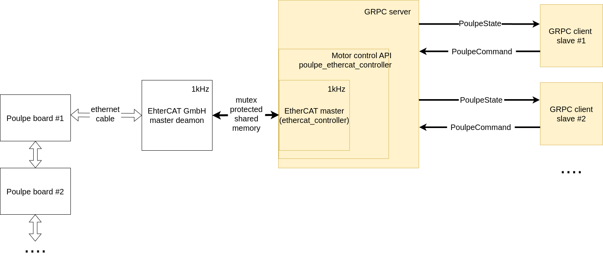

# Poulpe ehtercat controller

This is the code that manages the communication between the orbita2d and orbita3d actuators and the ethercat master. The code is written in rust. It is intended to communicate with poulpe boards running the [firmware_Poulpe](https://github.com/pollen-robotics/firmware_Poulpe).

There are four main crates in the code:
- `ethercat_controller`: This is the main crate that does the heavy lifting of the communication with the ethercat master.
    - It is a wrapper around the `ethercat-rs` crate. This crate enables to create the ethercat master form an ESI xml file.
    - See more in the [ethercat_controller/README.md](ethercat_controller/README.md)
- `poulpe_ethercat_controller`: This is an abstraction layer on top of the `ethercat_controller` crate. It provides a more user friendly interface to the user with specific functions for poulpe boards.
    - See more in the [poulpe_ethercat_controller/README.md](poulpe_ethercat_controller/README.md)
- `poulpe_ethercat_grpc`: This crate uses the `poulpe_ethercat_controller` to allow for reading assynchronously from multiple poulpe boards connected to the same ethercat master. It is based on the `grpc` protocol. It allows for creating a single server that can be accessed by multiple clients.
    - See more in the [poulpe_ethercat_grpc/README.md](poulpe_ethercat_grpc/README.md)
- `python_client`: This is a python wrapper of the `poulpe_ethercat_grpc` crate's client side. It allows for reading from multiple poulpe boards connected to the same ethercat master from python and in that way enables quick prototyping.
    - See more in the [python_client/README.md](python_client/README.md)
- `config`: This is a directory that contains the configuration files for the poulpe boards. It contains the eeprom configuration files for the LN9252 chip on the poulpe boards as well as the EtherCAT networks slave configuration yaml files that are used to create the ethercat master.
    - See more in the [config/README.md](config/README.md)

The full stack looks something like this:



`ethercat_controller` creates the direct connection to the EtherCAT master deamon (which communicates with the poulpe boards). `poulpe_ethercat_controller` provides the abstraction layer for the poulpe boards around the `ethercat_controller`. Finally, `poulpe_ethercat_grpc` creates the `server` that can be accessed by multiple `client` instances.


## Safety features

Each layer of the code has its own safety features. The `ethercat_controller` deals with the EtherCAT communication safety features (see more in the [ethercat_controller/README.md](ethercat_controller/README.md#main-features)). The `poulpe_ethercat_controller` crate has its own safety features that are specific to the poulpe boards (see more in the [poulpe_ethercat_controller/README.md](poulpe_ethercat_controller/README.md#safety-features)). The `poulpe_ethercat_grpc` crate has its own safety features that are specific to the GRPC communication (see more in the [poulpe_ethercat_grpc/README.md](poulpe_ethercat_grpc/README.md#safety-features)).

`ethercat_controller` crate has the following safety features:
- At the statup
    - Checks if the master and all the slaves are oprational
    - Checks if all the slaves are configured properly
- During the operation
    - Checks if the master and all the slaves are oprational
    - Checks if all the slaves are connected to the master
    - Checks if new slaves are connected to the master

`poulpe_ethercat_controller` crate has the following safety features:
- At the statup
    - Checks if ethercat network is operational and the topology is correct
    - Checks if all the boards are in the correct state
- During the operation
    - Checks if the boards are in the correct state and only allows turning them on if they are in the correct state

`poulpe_ethercat_grpc` crate has the following safety features:
- Real-time communication
    - All server and client messages are time stamped to ensure that the communication is real-time
    - The server discards all the client messages that are too old
    - The client that receives the messages that are too old will not process them and consider that the server is down
- Safety features
    - The server checks if the boards are in the fault state and if any of them is it sends the emergency stop signal to all the boards
    - The server continues the operation, reading the baoards states but not sending any commands to the boards

## Contents

- [Safety features](#safety-features)
- [Install and configure EtherCAT](#install-and-configure-ethercat)
    - [Installing EtherCAT](#installing-ethercat)
    - [Configuring the Poulpe board for the EtherCAT network](#configuring-the-poulpe-board-for-the-ethercat-network)
        - [Firmware version](#firmware-version)
        - [LAN9252 configuration](#lan9252-configuration)
    - [Install and build the `poulpe_ethercat_controller` code](#install-and-build-the-poulpe_ethercat_controller-code)
- [Running the code](#running-the-code)
    - [Running the test examples](#running-the-test-examples)
        - [Scan the network](#scan-the-network)
        - [Read poulpe states](#read-poulpe-states)
        - [Running a simple sinusoide trajectory](#running-a-simple-sinusoide-trajectory)
    - [Running the GRPC server](#running-the-grpc-server)
        - [Rust GRPC client examples](#rust-grpc-client-examples)
        - [Python GRPC client](#python-grpc-client)
        - [Orbita2d and Orbita3d control clients](#orbita2d-and-orbita3d-control-clients)

# Install and configure EtherCAT

## Installing EtherCAT

- `ethercat-rs` uses the `libclang` and `protobuf` libraries. To install them on ubuntu run:
```
sudo apt-get install libclang-dev
sudo apt-get install -y protobuf-compiler libprotobuf-dev
```

### Installing the EtherCAT master

- Install the dependencies (on ubuntu):
    - `sudo apt install autoconf libtool pkg-config`
- Install the [ethercat master](https://etherlab.org/en/ethercat/)
    - `git clone https://gitlab.com/etherlab.org/ethercat.git`
    - `cd ethercat`
    - use the `stable-1.6` branch `git checkout stable-1.6`
    - `./bootstrap`
    - `./configure --enable-generic --disable-8139too`
    - `make all modules`
    - `sudo make modules_install install`
    - `sudo depmod`
    - add the path to the `ethercat` binary to the `ETHERCAT_PATH` variable (ex. `export ETHERCAT_PATH=$HOME/ethercat`)

### Configure EtherCAT master
In order configure the `ethercat` we need to give the master the MAC address of the PC/ehternet port.

- run `ip a` to find the mac address of the ethernet port:

    ```shell
    2: enp8s0f2: <NO-CARRIER,BROADCAST,MULTICAST,UP> mtu 1500 qdisc mq state DOWN group default qlen 1000
        link/ether d0:63:b4:05:47:37 brd ff:ff:ff:ff:ff:ff
    ```
- Modify the file `/usr/local/etc/ethercat.conf`
    - `MASTER0_DEVICE` - set the mac address (ex. `d0:63:b4:05:47:37`) or the name of the port (ex. `enp8s0f2`)
    - `DEVICE_MODULES` set to `”generic”`
- Then condifure the udev rules for `/dev/EtherCAT0`(go to the mode `0666`)
    - create the ethercat rule: `sudo nano /etc/udev/rules.d/99-EtherCAT.rules`
    - add the following line:
    `KERNEL == "EtherCAT[0-9]*" , MODE ="0666", GROUP ="users"`
    - reload the rules:
    `sudo udevadm control --reload-rules && sudo udevadm trigger`

    </details>


> There are some helpful notion pages with a bit more info on the ethercat setup:
> -  [Setup EtherCAT](https://www.notion.so/pollen-robotics/Setup-EtherCAT-1ecce786847e495bb1b4b399740727af)
> - [Integration to Bedrock](https://www.notion.so/pollen-robotics/EtherCAT-9864e7348e0341b592b2cf95acaf1bc2?pvs=4#f3a010c9cd474eea92a9f0dfe609a203) (a bit more recent)
> - Also the [ethercat docs](https://etherlab.org/download/ethercat/ethercat-1.5.2.pdf) are very helpful


### Start the EtherCAT master

- `sudo ethercatctl start`
- verify that `/dev/EtherCAT0` exists (`ls /dev/EtherCAT0`).

The output should be something like:
```shell
$ ls -l /dev/EtherCAT
crw-rw-rw- 1 root users 509, 0 Jun  4 07:01 /dev/EtherCAT0
```

- Use `ethercat` (installed with `make install` after the compilation) to veviry is the master is working
    - ex. `ethercat graph` (list of nodes connected)
    - ex. `ethercat slaves` (list of slaves connected)

The output should be something like:
```shell
$ ethercat graph
/* EtherCAT bus graph. Generated by 'ethercat graph'. */

strict graph bus {
    rankdir="LR"
    ranksep=0.8
    nodesep=0.8
    node [fontname="Helvetica"]
    edge [fontname="Helvetica",fontsize="10"]

    master [label="EtherCAT\nMaster"]

}
```


## Configuring the Poulpe board for the EtherCAT network

Once you have the ethercat master running and you connected your poulpe board to the network, you need to configure the poulpe board to work with the network.

There are two main steps to prepare the poulpe board for the ethercat network:
- Make sure the poulpe is running the appropriate version of the firmware
- Make sure the EEPROM of the LAN9252 chip on the poulpe board is flashed with the appropriate configuration file.

### Firmware version

- Make sure that the poulpe board is running the appropriate version of the firmware.

`firmware_poulpe` version | `poulpe_etehract_controller` version
--- | ---
v0.9.x | v0.9.x
v1.0.x | v1.0.x or higher
v1.5.x | v1.5.x 

### LAN9252 configuration
- Make sure that the poulpe board is configured properly for the ethercat network.
    - The EEPROM of the LAN9252 chip on the poulpe board needs to be flashed with the appropriate configuration file.

- If the board is not configured, once connected to the ethercat network, you it will not display its proper name when you run `ethercat slave`

```sh
$ ethercat slave
0  0:0  OP  +  00000000:00000000
```

- This means that the EEPROM is not configured. TTo configure it youn need to flush the binary config file to the EEPROM using the `ethercat sii_write` command.
    - ex. `ethercat sii_write -p0 Orbita2d.bin` (may need sudo)
        - If there is an error in the transfer try disconnecting and reconnecting the the ethernet cable.
        - **Make sure to restart the board after this (diconnect the power)**
    - The configuration files are located in the `config/esi` directory.
    - See the [config/esi/README.md](config/esi/README.md) for more info.

- Then you should have the proper name of the device. For example:
```sh
$ ethercat slave
0  0:0  OP  +  Orbita2d
```

- You can also check the available PDO mappings with `ethercat pdos`.

<details><summary>Example for version v0.9.x</summary>

```sh
$ ethercat pdos

SM0: PhysAddr 0x1000, DefaultSize    0, ControlRegister 0x64, Enable 1
  RxPDO 0x1600 "MotorIn"
    PDO entry 0x0010:01,  8 bit, "torque_state"
    PDO entry 0x0011:01, 32 bit, "target"
    PDO entry 0x0011:02, 32 bit, "velocity_limit"
    PDO entry 0x0011:03, 32 bit, "torque_limit"
    PDO entry 0x0012:01, 32 bit, "target"
    PDO entry 0x0012:02, 32 bit, "velocity_limit"
    PDO entry 0x0012:03, 32 bit, "torque_limit"
SM1: PhysAddr 0x1200, DefaultSize    0, ControlRegister 0x20, Enable 1
  TxPDO 0x1a00 "Orbita"
    PDO entry 0x0020:00,  8 bit, "state"
    PDO entry 0x0020:01,  8 bit, "type"
SM2: PhysAddr 0x1300, DefaultSize    0, ControlRegister 0x22, Enable 1
  TxPDO 0x1a01 "MotorOut"
    PDO entry 0x0030:00,  8 bit, "torque_enabled"
    PDO entry 0x0031:01, 32 bit, "position"
    PDO entry 0x0031:02, 32 bit, "velocity"
    PDO entry 0x0031:03, 32 bit, "torque"
    PDO entry 0x0031:04, 32 bit, "axis_sensor"
    PDO entry 0x0032:01, 32 bit, "position"
    PDO entry 0x0032:02, 32 bit, "velocity"
    PDO entry 0x0032:03, 32 bit, "torque"
    PDO entry 0x0032:04, 32 bit, "axis_sensor
```
</details>

<details><summary>Example for version v1.0.x</summary>

```sh
$ ethercat pdos
SM0: PhysAddr 0x1000, DefaultSize    0, ControlRegister 0x64, Enable 1
  RxPDO 0x1600 "OrbitaIn"
    PDO entry 0x6041:00, 16 bit, "controlword"
    PDO entry 0x6060:00,  8 bit, "mode_of_operation"
    PDO entry 0x607a:01, 32 bit, "target_position"
    PDO entry 0x607a:02, 32 bit, "target_position"
    PDO entry 0x607a:03, 32 bit, "target_position"
    PDO entry 0x60ff:01, 32 bit, "target_velocity"
    PDO entry 0x60ff:02, 32 bit, "target_velocity"
    PDO entry 0x60ff:03, 32 bit, "target_velocity"
    PDO entry 0x607f:01, 32 bit, "velocity_limit"
    PDO entry 0x607f:02, 32 bit, "velocity_limit"
    PDO entry 0x607f:03, 32 bit, "velocity_limit"
    PDO entry 0x6071:01, 32 bit, "target_torque"
    PDO entry 0x6071:02, 32 bit, "target_torque"
    PDO entry 0x6071:03, 32 bit, "target_torque"
    PDO entry 0x6072:01, 32 bit, "torque_limit"
    PDO entry 0x6072:02, 32 bit, "torque_limit"
    PDO entry 0x6072:03, 32 bit, "torque_limit"
SM1: PhysAddr 0x1200, DefaultSize    0, ControlRegister 0x22, Enable 1
  TxPDO 0x1700 "OrbitaState"
    PDO entry 0x603f:00, 16 bit, "error_code"
    PDO entry 0x603f:01, 16 bit, "error_code"
    PDO entry 0x603f:02, 16 bit, "error_code"
    PDO entry 0x603f:03, 16 bit, "error_code"
    PDO entry 0x6402:00,  8 bit, "actuator_type"
    PDO entry 0x607c:01, 32 bit, "axis_position_zero_offset"
    PDO entry 0x607c:02, 32 bit, "axis_position_zero_offset"
    PDO entry 0x607c:03, 32 bit, "axis_position_zero_offset"
    PDO entry 0x6500:01, 32 bit, "board_temperatures"
    PDO entry 0x6500:02, 32 bit, "board_temperatures"
    PDO entry 0x6500:03, 32 bit, "board_temperatures"
    PDO entry 0x6501:01, 32 bit, "motor_temperatures"
    PDO entry 0x6501:02, 32 bit, "motor_temperatures"
    PDO entry 0x6501:03, 32 bit, "motor_temperatures"
SM2: PhysAddr 0x1300, DefaultSize    0, ControlRegister 0x20, Enable 1
  TxPDO 0x1800 "OrbitaOut"
    PDO entry 0x6040:00, 16 bit, "statusword"
    PDO entry 0x6061:00,  8 bit, "mode_of_operation_display"
    PDO entry 0x6064:01, 32 bit, "actual_position"
    PDO entry 0x6064:02, 32 bit, "actual_position"
    PDO entry 0x6064:03, 32 bit, "actual_position"
    PDO entry 0x606c:01, 32 bit, "actual_velocity"
    PDO entry 0x606c:02, 32 bit, "actual_velocity"
    PDO entry 0x606c:03, 32 bit, "actual_velocity"
    PDO entry 0x6077:01, 32 bit, "actual_torque"
    PDO entry 0x6077:02, 32 bit, "actual_torque"
    PDO entry 0x6077:03, 32 bit, "actual_torque"
    PDO entry 0x6063:01, 32 bit, "actual_axis_position"
    PDO entry 0x6063:02, 32 bit, "actual_axis_position"
    PDO entry 0x6063:03, 32 bit, "actual_axis_position"
```

</details>

## Install and build the `poulpe_ethercat_controller` code

Now that you have the ethercat master running and the poulpe board configured, you can run the code.

- Clone the repo
```shell
git clone git@github.com:pollen-robotics/poulpe_ethercat_controller.git
```

- Build the code
```shell
cargo build --release
```
If the build passes that means that the code is working properly.

# Running the code

## Running the test examples

### Scan the network

- Scan the network to find the poulpe boards connected to the network
```shell
RUST_LOG=info cargo run --release --example scan_network
```
ex.
```shell
$ RUST_LOG=info cargo run --release --example scan_network

[2024-12-03T07:36:38Z INFO  network_scan] Creating the therCAT master
[2024-12-03T07:36:38Z INFO  ethercat_controller::ethercat_controller] Found 1 slaves
[2024-12-03T07:36:38Z INFO  ethercat_controller::ethercat_controller] Slave "NeckOrbita3d" at position 0
[2024-12-03T07:36:38Z INFO  network_scan] Waiting for therCAT master to be ready
[2024-12-03T07:36:38Z INFO  network_scan] EtherCAT master is ready
[2024-12-03T07:36:38Z INFO  network_scan] ---------------------------
[2024-12-03T07:36:38Z INFO  network_scan] Scanning network
[2024-12-03T07:36:38Z INFO  network_scan] Slave ID: 0, name: NeckOrbita3d

```

### Read poulpe states

- Read the state of the poulpe boards connected to the network
```shell
RUST_LOG=info cargo run --release --example poulpe_read_states # add the slave id ex. 0
```
ex.
```shell
$ RUST_LOG=info cargo run --release --example poulpe_read_states 0

[2024-12-03T07:52:18Z INFO  poulpe_read_states] Loading the controller
[2024-12-03T07:52:18Z INFO  ethercat_controller::ethercat_controller] Found 1 slaves
[2024-12-03T07:52:18Z INFO  ethercat_controller::ethserverercat_controller] Slave "NeckOrbita3d" at position 0
[2024-12-03T07:52:18Z INFO  poulpe_read_states] Waiting for controller to be ready
[2024-12-03T07:52:18Z INFO  poulpe_read_states] Controller is ready
[2024-12-03T07:52:18Z INFO  ethercat_controller::ethercat_controller] Master and all slaves operational!
[2024-12-03T07:52:20Z INFO  poulpe_read_states] Pos: [0.44092038, 0.43091735, -3.8916345], 	 Vel: [9.1e-44, -8e-45, -7.533014e-5],	 Axis: [0.42992437, 0.41074842, 2.40121], 	 Board Temp: [38.634876, 38.82775, 38.124046], 	 Motor Temp: [-273.15, -273.15, -273.15]
[2024-12-03T07:52:20Z INFO  poulpe_read_states] Pos: [0.44092038, 0.43091735, -3.8916345], 	 Vel: [9.1e-44, -8e-45, -7.533014e-5],	 Axis: [0.42992437, 0.41074842, 2.40121], 	 Board Temp: [38.634876, 38.82775, 38.124046], 	 Motor Temp: [-273.15, -273.15, -273.15]
[2024-12-03T07:52:20Z INFO  poulpe_read_states] Pos: [0.44092038, 0.43091735, -3.8916345], 	 Vel: [9.1e-44, -8e-45, -7.533014e-5],	 Axis: [0.42992437, 0.41074842, 2.40121], 	 Board Temp: [38.634876, 38.82775, 38.124046], 	 Motor Temp: [-273.15, -273.15, -273.15]
[2024-12-03T07:52:20Z INFO  poulpe_read_states] Pos: [0.44092038, 0.43091735, -3.8916345], 	 Vel: [9.1e-44, -8e-45, -7.533014e-5],	 Axis: [0.42992437, 0.41074842, 2.40121], 	 Board Temp: [38.634876, 38.82775, 38.124046], 	 Motor Temp: [-273.15, -273.15, -273.15]
[2024-12-03T07:52:20Z INFO  poulpe_read_states] Pos: [0.44092038, 0.43091735, -3.8916345], 	 Vel: [9.1e-44, -8e-45, -7.533014e-5],	 Axis: [0.42992437, 0.41074842, 2.40121], 	 Board Temp: [38.634876, 38.82775, 38.124046], 	 Motor Temp: [-273.15, -273.15, -273.15]

```

### Running a simple sinusoide trajectory

- Run a simple sinusoide trajectory on the poulpe boards connected to the network
```shell
RUST_LOG=info cargo run --release --example poulpe_sinus # add the slave id ex. 0
```

ex.
```shell
$ RUST_LOG=info cargo run --release --example poulpe_sinus 0

[2024-12-03T07:52:18Z INFO  poulpe_read_states] Loading the controller
[2024-12-03T07:52:18Z INFO  ethercat_controller::ethercat_controller] Found 1 slaves
[2024-12-03T07:52:18Z INFO  ethercat_controller::ethercat_controller] Slave "NeckOrbita3d" at position 0
[2024-12-03T07:52:18Z INFO  poulpe_read_states] Waiting for controller to be ready
[2024-12-03T07:52:18Z INFO  poulpe_read_states] Controller is ready
[2024-12-03T07:52:18Z INFO  ethercat_controller::ethercat_controller] Master and all slaves operational!
...
```


## Running the GRPC server

- Run the GRPC server code

```shell
RUST_LOG=info cargo run --release # add the yaml config file ex. config/robot.yaml
```

- The yaml file contains the configuration of the ethercat network and the poulpe boards connected to the network. The typical yaml file is located in the `config` directory. See the [config/README.md](config/README.md) for more info.
- The GPRC server runs at the ip address of your pc with the port `50098` (ex. `192.168.0.67:50098`)

- Once the server is up and running you can connect to it with the GRPC client, either directly from the examples in this repo or through the ROS stack using `orbita2d_control` or `orbita3d_control` packages.

<details><summary>Example of running the server with the Orbita3d yaml file</summary>

For example, if you have one one poulpe board connected to the network (ex. one orbita3d with the name of `NeckOrbita3d`), and you define your yaml file for example:

```yaml
ethercat:
  master_id: 0
  cycle_time_us: 1000 # us - cycle time of the ethercat 1/frequency
  command_drop_time_us: 5000 # us (5ms default) 
  watchdog_timeout_ms: 500 # ms (500ms default)
  mailbox_wait_time_ms: 10000 #ms  (1s default)
```

You can run the server with:

```shell
$ RUST_LOG=info cargo run --release -- config/my_network_config.yaml # or config/robot.yaml for defualt config

[2024-12-03T07:58:37Z INFO  ethercat_controller::ethercat_controller] Found 1 slaves
[2024-12-03T07:58:37Z INFO  ethercat_controller::ethercat_controller] Slave "NeckOrbita3d" at position 0
[2024-12-03T07:58:37Z INFO  server] Setup Slave 0...
[2024-12-03T07:58:37Z INFO  ethercat_controller::ethercat_controller] Master and all slaves operational!
[2024-12-03T07:58:37Z INFO  poulpe_ethercat_controller] Slave 0, inital state: SwitchOnDisabled
[2024-12-03T07:58:37Z INFO  poulpe_ethercat_controller] Slave 0, setup done! Current state: SwitchedOn
[2024-12-03T07:58:37Z INFO  server] Done!
[2024-12-03T07:58:37Z INFO  server] POULPE controller ready!
[2024-12-03T07:58:47Z INFO  ethercat_controller::ethercat_controller] EtherCAT loop: 913.37 Hz
```

</details>

### Rust GRPC client examples

- The simplest example is the `client_listener` example. This example connects to the server and listens for the states of the poulpe boards connected to the network.

```shell
RUST_LOG=info cargo run --release --example client_listener # add the slave id (ex. 0) or slave name (ex. LeftWristOrbita3d)
```

ex.
```shell
$ RUST_LOG=info cargo run --release --example client_listener 0 # slave id 0

[2024-12-03T08:21:11Z INFO  client_listener] Slave id: 0
[2024-12-03T08:21:13Z INFO  client_listener] Slave ids in network: ([0], ["NeckOrbita3d"])
[2024-12-03T08:21:13Z INFO  client_listener] Compliant: false,	 Target position: [0.0, 0.0, 0.0],	 Current position: [0.441356, 0.43080845, -3.891907]
[2024-12-03T08:21:13Z INFO  client_listener] Compliant: false,	 Target position: [0.0, 0.0, 0.0],	 Current position: [0.441356, 0.43080845, -3.891907]
[2024-12-03T08:21:13Z INFO  client_listener] Compliant: false,	 Target position: [0.0, 0.0, 0.0],	 Current position: [0.441356, 0.43080845, -3.891907]
...

```

- Another example is the `client_sinus` example. This example connects to the server and sends a simple sinusoide trajectory to the poulpe boards connected to the network.

```shell
RUST_LOG=info cargo run --release --example client_sinus # add the slave id (ex. 0) or slave name (ex. LeftWristOrbita3d)
```


### Python GRPC client

- The `poulpe_ethercat_grpc` crate has a python client that can be used to connect to the GRPC server and read the states of the poulpe boards connected to the network. The python client is a wrapper around the GRPC client that is generated in the `python_client` crate. See the [python_client/README.md](python_client/README.md) for more info.
- The python client uses the `maturin` package to build the python wheel.
- See the [python_client/README.md](python_client/README.md) for instructions on how to build the python client.


Once you have your python bindings you can run the examples from the `python_client/scripts` directory or notebooks from the `python_client/notebooks` directory.

Or you can write your own python scripts to interact with the poulpe boards connected to the network. For example

```python
from python_client import PyPoulpeRemoteClient
import time

slave_id = 0
no_axis = 3

print('Connecting on slave: {}'.format(slave_id))
# Create an instance of the client
client = PyPoulpeRemoteClient("http://127.0.0.1:50098", [slave_id], 0.001)

time.sleep(1.0)

print("Connected slaves to master: {}".format(client.get_connected_devices()))

print("Slave {} compliancy is: {}".format(slave_id, client.get_torque_state(slave_id)))
print("Slave {} current position: {}".format(slave_id, client.get_position_actual_value(slave_id)))
```
which might output something like:
```shell
Connecting on slave: 0
Connected slaves to master: ([0], ['NeckOrbita3d'])
Slave 0 compliancy is: True
Slave 0 current position: [-0.0011222249595448375, 3.743586057680659e-05, 6.8065196501265746e-06]
```

### Orbita2d and Orbita3d control clients

- Once you have your GRPC server running you can connect to it using the
    - `orbita2d_control` - [see on github](https://github.com/pollen-robotics/orbita2d_control)
    - `orbita3d_control` - [see on github](https://github.com/pollen-robotics/orbita3d_control)
- The ROS packages are used to control the orbita2d and orbita3d actuators, implementing the kinematics of the actuators enabling to control them in joint space or cartesian space.
- Also, `orbita2d_control` and `orbita3d_control` are ROS packages that use the `poulpe_ethercat_grpc` crate to connect to the GRPC server and control the poulpe boards connected to the network.

## Support

This project adheres to the Contributor [code of conduct](CODE_OF_CONDUCT.md). By participating, you are expected to uphold this code. Please report unacceptable behavior to [contact@pollen-robotics.com](mailto:contact@pollen-robotics.com).

Visit [pollen-robotics.com](https://pollen-robotics.com) to learn more or join our [Dicord community](https://discord.gg/vnYD6GAqJR) if you have any questions or want to share your ideas.
Follow [@PollenRobotics](https://twitter.com/pollenrobotics) on Twitter for important announcements.
