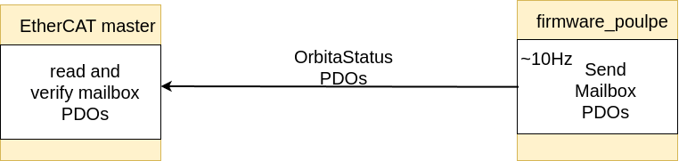
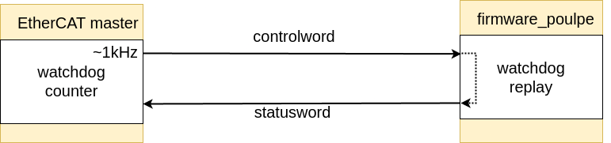

# ethercat_controller crate

This crate is a wrapper around the `ethercat-rs` crate that provides a more user-friendly interface to the IgH Ethercat master. 

- [ethercat-rs](https://github.com/ethercat-rs/ethercat)
- [IgH Ethercat master](https://etherlab.org/en_GB/ethercat)

The crate is desigend to work with poulpe boards as slaves, detecting them at startup and monitoring them at runtime. It also implements a watchdog and mailbox PDOs to ensure proper communication with the slaves as well as numerous safety checks to ensure that all the slaves are operational.

### Main features

- Automatic slave detection at startup + PDO reading from EEPROM
    - Fails if a slave is not configured properly (no PDOs in EEPROM)
- Automatic slave monitoring at runtime
    - Fails if a slave is disconnected in runtime
    - Fails if a new slave is connected in runtime
    - Fails if one of the slaves is not operational in runtime
    - These fails result in stopping the operation of the master if the feature `stop_opeation_on_error` is enabled
    - Otherwise, the master will continue to operate but will be in the non-operational state
- Uses mailbox PDOs to ensure proper communication with the slaves 
    - Behind the feature `verify_mailboxes` (enabled by default) 
    - Fails if the slave does nor write the mailbox entries in some predefined time 
        - default 1s
        - considered not operational 
- Implements an additional watchdog to ensure the slaves are reading and responding to the commands
    - Behind the feature `enable_watchdog` (enabled by default)
    - Fails if the slave does not update its watchdog entry in some predefined time
        - default 500ms
        - considered not operational
    

## List of features

feature | description | enabled by default
--- | --- | ---
`verify_mailboxes` | Verify the mailbox PDOs | yes
`enable_watchdog` | Enable the watchdog | yes
`stop_opeation_on_error` | Stop the operation if a slave is not operational | no

### Mailbox PDOs

Mailbox PDOs are used to establish a communication between the master and the slave devices that implements a handshake, ensuring that the data is read and written properly. If the slave has not written the data, the master will not read the old data but will read zeros. 

This feature is used in the `ethercat_controller` crate to ensure that the slave is operational aand it sends the data in real-time. If the slave does not write the data in some predefined time (by default is 1s), the master will consider the slave not operational and will fail. 

The mailbox PDOs are sent from the slave to the master at the frequency of around 10Hz.

### Watchdog

Watchdog is used to ensure that the slave is reading and responding to the commands, similar to the strategy using in the mailbox PDOs. If the slave does not update its watchdog entry in some predefined time (by default is 500ms), the master will consider the slave not operational and will fail. 

Each time the master sends the command to the slave, it updates the watchdog counter and sends it throuh the EtherCAT communication. The slave is recevies the watchdog and replays it back to the master. The watchdog counter is a 3bit countre (0-7) as that is the maximum number of bits that is available in the `statusword` (bits 8, 14 and 15). 

The watchdog is implemented in a way where the master sends the watchdog counter through the available bits (bits 11-13) of `controlword` and the slave sends it back through the available bits (bits 8, 14 and 15) of the `statusword`. 

Therefore, as opposed to mailboxes, the watchdog is however used in bidirectinal manner. It is a signal to the slave that the master is operational and is sending the commands, and the signal to the master that the slave is operational and is reading the commands. The poulpe firmware is listenning to the watchdog and if it is not updated in some predefined time (by default 100ms), the slave will consider the master not operational and will stop the motors.

The watchdog is communicated at the frequency of the EtherCAT loop (1kHz).
