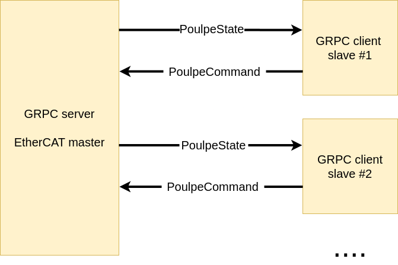

# Poulpe ethercat grpc server and client

This crate provides a grpc server and client for controlling the poulpe boards over ethercat.

The server creates the ethercat master and creates the gprc api that allows the connection of multiple clients corresponding to the number of poulpe boards connected to the ehtercat master.

### Real-time communication 
Client server communication in gprc is not real-time and given that we are controlling a real-time system, all the messages exchanged between the server and the client are timestamped and security checks are performed to ensure that the messages are not too old.

- If server reads the clients message that has a timestamp older than 5ms, it will ignore it
- If client reads the server messages that are older than 1second (defined in the configuration file), it will consider that the server is down and will kill the program

### Client-server communication

The server communicates with the ethercat master reading and writing the data to the poulpe boards.

The client sends the `PoulpeCommand` message to the server and receives the `PoulpeState` message from the server. `PoulpeCommand` message contains 
- `id` : id of the poulpe board
- `emergency_stop` : emergency stop flag (true for emergency stop)
- `compliancy` : activate the board (true for active)
- `mode_of_operation` : mode of operation 
- `target_position` : target position 
- `target_velocity` : target velocity
- `target_torque` : target torque
- `velocity_limit` : velocity limit
- `torque_limit` : torque limit
- `published_timestamp` : timestamp of the message (timestamp when the message was sent)

`PoulpeState` message contains:
- `id` : id of the poulpe board
- `mode_of_operation` : mode of operation
- `actual_position` : actual position
- `actual_velocity` : actual velocity
- `actual_torque` : actual torque
- `axis_sensors` : axis sensors
- `axis_sensor_zeros` : axis sensor zeros
- `board_temperatures` : board temperatures
- `motor_temperatures` : motor temperatures
- `requested_target_position` : requested target position
- `requested_velocity_limit` : requested velocity limit
- `requested_torque_limit` : requested torque limit
- `state` : state of the board
- `error_codes` : error codes
- `compliant` : compliant flag
- `published_timestamp` : timestamp of the message (timestamp when the message was sent)
